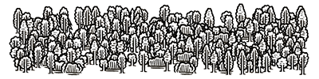

# Forest Generator

Generate your ideal forest image based on the sprite(s) provided.

In other words, just provide means to transform this:


into this:



or this:


or even into the image of such a crazy resolution as 4000x4000 pixels with 35000 tress painted on it: 


randomly.

This is (still) not a real product, but hobby/demo project, written in TypeScript, applying together the following frameworks and technologies:
* React
* Redux
* Webpack
* Web Workers
* Bootstrap
* HTML5 Canvas

Although it is a hobby / demo project, it can be quite useful when hand-creating some fantasy/vintage/old maps. But... enough talking, let's play around with the [working demo](https://sharpcoding.github.io/forest-generator/).

## Succinct user's manual 

The application is (currently) fairly simple: it just asks for the required number of trees, target canvas dimensions and off we go - enjoy the forest generated !

There are restrictions, though, for:
* canvas dimensions
* number of trees

All these restrictions can be configured in the [config file](/src/config.json).

## Dispersion

[The algorithm](src/algorithms/treeGeneratorWithDispersion.ts) for rendering tries its best to place trees randomly, but not "too randomly". Thus a parameter of *dispersion* was introduced.

Dispersion - and more precisely - the *recommended* dispersion - is just a plain number (of pixels), representing a desired distance between:
* a given tree,
* the closest of any other (rendered) trees.

So for a canvas:
* of 500 pixels wide
* of 500 pixels high
* having 250 trees

the algorithm will very easily distribute trees with the recommended dispersion of 10 pixels. However, it is not possible to place 250 trees on such a canvas with dispersion of, say, 20 pixels. In case of dispersion being too high, algorithm will try to (temporarily) decrease it (for a tree and make a placement). It is inefficient and cpu-intensive operation, so this is why the [Web Worker](src/algorithms/treeGeneratorWithDispersion.ts) got applied. 

Disclaimer: the "place randomly with dispersion" algorithm is slow/inefficient by design, since it is provided just for fun/demo purposes (to demonstrate a Web Worker behind the scenes) !

## Planned development

Priority list from the highest to the lowest:

Version 0.5
- [x] Download rendered PNG button
- [ ] Pattern rendering
- [ ] Add Stop render button 
- [ ] Add current render % complete span/div 

Further development:
- [ ] Config screen for [config.json](src/config.json) settings.
- [ ] Persisting session configuration
- [ ] Uploading the custom sprite file
- [ ] Extending the [config.json](src/config.json) with "land or sea" areas by applying a pre-defined black&white map (assumption: it won't be possible to plant trees on the sea)
- [ ] Generalizing the "land or sea" approach to N custom "environments" with custom sprites etc.
- [ ] Extending the [config.json](src/config.json) with settings that can refer to a single sprite entity, describing cardinality, render probability, desired dispersion and minimal dispersion

## Installing

```
npm install -g local-web-server
npm install
```

## Running development version

Running on Windows:
```
npm run start-w
```
Running on Linux/OSX:
```
npm run start-x
```

Remark: HTML5 Canvas proved to cause refresh problems when working with the webpack-dev-server hot reloading, so every time the *start* command executes, a new [bundle.js](/dist/bundle.js) is regenerated and a local web server started. This web server start can be avoided by just recompiling the source:

```
npm run recompile
```

and hitting refresh in the browser window.